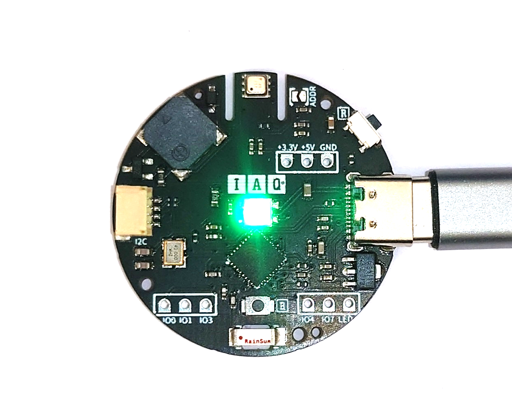
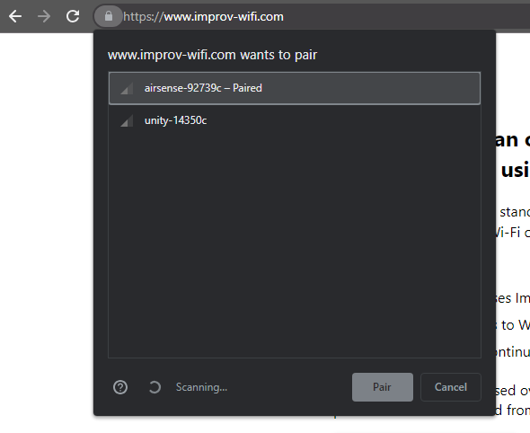
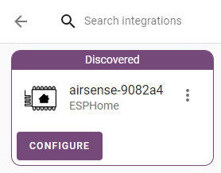
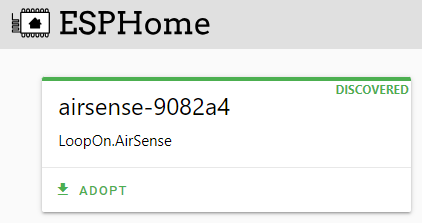
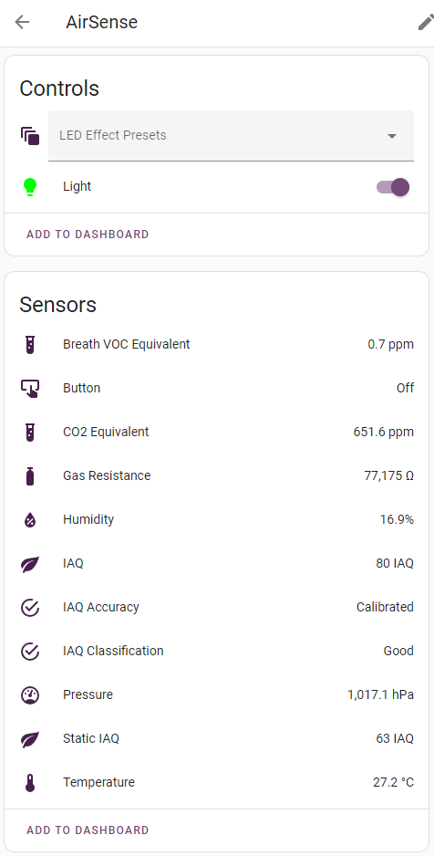

# [AirSense - Indoor Air Quality Sensor Board](https://loopon.tech/products/airsense)<!-- omit from toc -->
This repository contains the pre-installed ESPHome config for the AirSense board.
Specifications of the board can be found at https://loopon.tech/products/airsense
<p align="center">
  
</p>


> 

&#x26a0;&#xfe0f; **Caution**: Some electronic components are highly sensitive to Electrostatic Discharge and are damaged easily by this. Avoid direct contact with the LED and the ESP.


# Table of Contents<!-- omit from toc -->
- [Getting Started](#getting-started)
  - [Connecting to WiFi](#connecting-to-wifi)
  - [Home Assistant](#home-assistant)
  - [Modifying ESPHome Config](#modifying-esphome-config)
- [Flashing the AirSense Board](#flashing-the-airsense-board)

# Getting Started
The AirSense board comes pre-installed with ESPHome. The configuration can be found [here](./esphome/loopon_airsense.yaml).

## Connecting to WiFi
There are two ways to connect the AirSense board to your WiFi network:

### Using Imrpov<!-- omit from toc -->
1. Power up the AirSense board.
1. Go to https://www.improv-wifi.com/ on your phone or a computer with Bluetooth.
1. Click "Connect device to Wi-Fi".
1. Select the AirSense device.
<p align="center">
  
</p>

5. Input your SSID and password.
1. Click Save.

### Using the Access Point<!-- omit from toc -->
1. Power up the AirSense board.
1. On your phone or computer, search for the AirSense WiFi network.
1. Once connected, your phone will be redirected to the WiFi setup page. If you are not redirected, open a browser and go to http://192.168.4.1
1. Select your WiFi network SSID from the list and input the password if needed.
1. Click Save.

## Home Assistant
Once you have successfully connected to your WiFi network, you can integrate the device to Home Assistant.
You must have the ESPHome Add-on installed. If you do not have the Add-on then follow the 'Installing ESPHome Dashboard' guide [here](https://esphome.io/guides/getting_started_hassio.html).

### Discovery<!-- omit from toc -->
Home Assistant and the ESPHome Add-on will automatically detect the AirSense device.

You can find the device in:
* Integrations: [](https://my.home-assistant.io/redirect/integrations/)
<p align="center">
  
</p>

* ESPHome Dashboard: [](https://my.home-assistant.io/redirect/supervisor_ingress/?addon=5c53de3b_esphome)
<p align="center">
  
</p>

Note: If the device does not show up then please try restarting Home Assistant. [](https://my.home-assistant.io/redirect/server_controls/)

### View Device<!-- omit from toc -->
You can now view the AirSense board in [](https://my.home-assistant.io/redirect/devices/)
<p align="center">
  
</p>

## Modifying ESPHome Config
You can modify the way the device behaves by compiling and flashing the AirSense board.

### Using ESPHome Dashboard in Home Assistant (Easy)<!-- omit from toc -->
1. Go to the ESPHome dashboard in Home Assistant.
2. Select the device you would like to modify and click "Edit".
3. Make your changes in the yaml and click "Install".
4. Select "Wirelessly" from the pop-up.
5. ESPHome will now compile the latest yaml and install it on the device. This will take a few minutes.

### Using ESPHome CLI (Medium)<!-- omit from toc -->
With ESPHome installed on your computer ([guide](https://esphome.io/guides/installing_esphome.html)), you can clone and modify the [loopon_airsense.yaml](./esphome/loopon_airsense.yaml), compile and flash the AirSense board.

To compile and flash use:
```sh
# Make sure AirSense board is in Flash mode
esphome run ./esphome/loopon_airsense.yaml --no-logs
# Reset device when done
```

To monitor logs use:
```sh
esphome logs ./esphome/loopon_airsense.yaml 
```

You can optionally add the device port to the commands above:
```sh
 --device=COM19 
```

# Flashing the AirSense Board
To flash the AirSense board, it must be put in the correct boot mode.
You can do this by:
1. Holding down the boot button.
1. Momentarily pressing the reset button.
1. Then, releasing the boot button.

Once flashing has completed, press the reset button to restart in normal mode.

