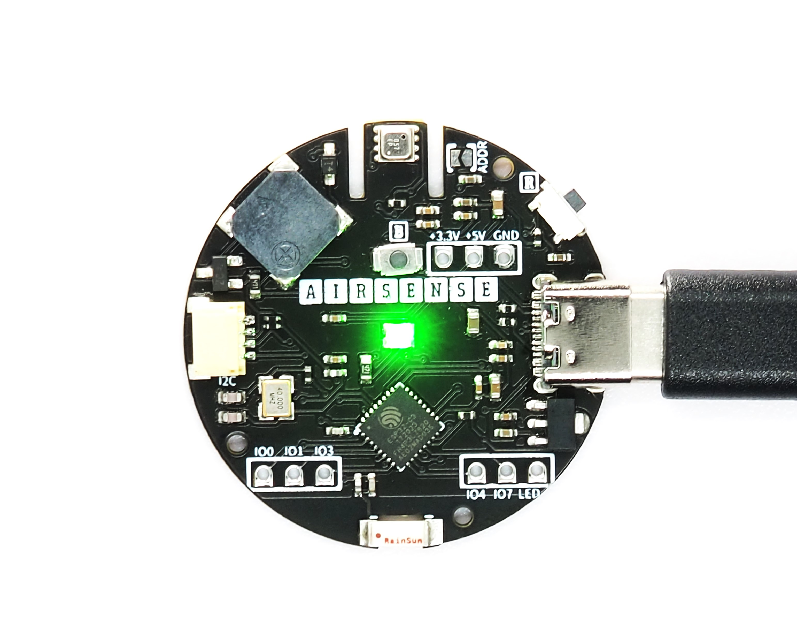
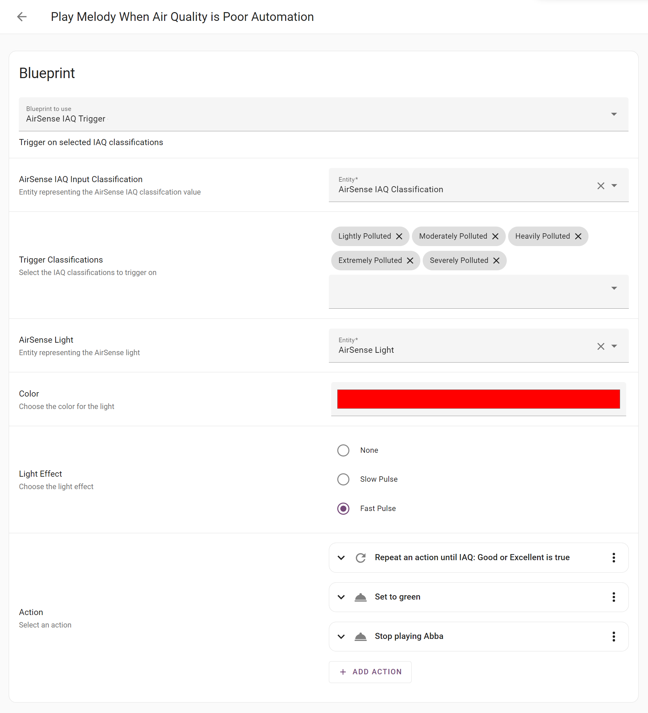
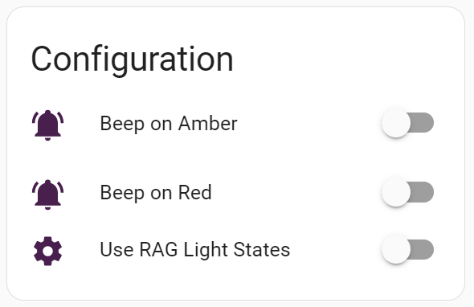
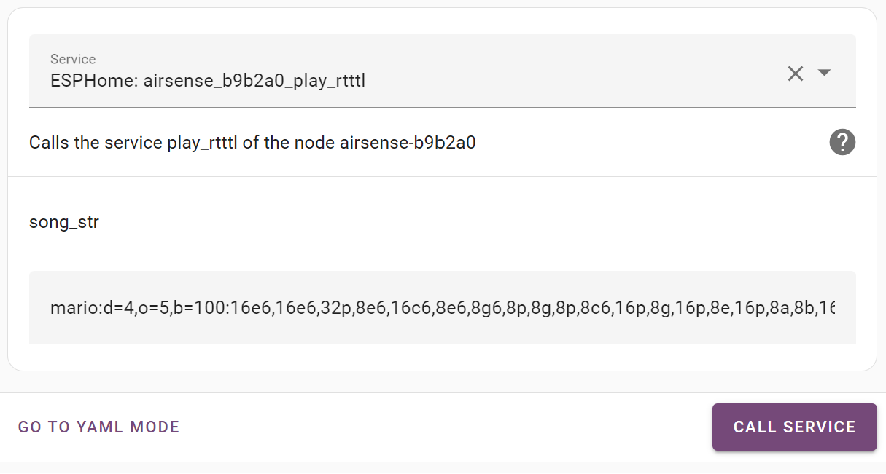

# [AirSense - Indoor Air Quality Sensor Board](https://loopon.tech/products/airsense)<!-- omit from toc -->
This repository contains the pre-installed ESPHome config for the AirSense board.
Specifications of the board can be found at https://loopon.tech/products/airsense
<p align="center">
  
</p>
<p align="center">
<a href="https://my.home-assistant.io/redirect/blueprint_import/?blueprint_url=https%3A%2F%2Fgithub.com%2FLoopOnCode%2FAirSense%2Fblob%2Fmain%2Fblueprints%2Floopon_airsense_blueprint.yaml" target="_blank"></a>
</p>

> 

&#x26a0;&#xfe0f; **Caution**: Some electronic components are highly sensitive to Electrostatic Discharge and are damaged easily by this. Avoid direct contact with the LED and the ESP.


# Table of Contents<!-- omit from toc -->
- [Getting Started](#getting-started)
  - [Connecting to WiFi](#connecting-to-wifi)
- [Home Assistant](#home-assistant)
  - [Discovery](#discovery)
  - [View Device](#view-device)
  - [Import Blueprint](#import-blueprint)
  - [Disabling Default LED and Buzzer Behaviour](#disabling-default-led-and-buzzer-behaviour)
  - [RTTTL (Melody) Service](#rtttl-melody-service)
- [Modifying ESPHome Config](#modifying-esphome-config)
  - [Using ESPHome Dashboard in Home Assistant](#using-esphome-dashboard-in-home-assistant)
  - [Using ESPHome CLI](#using-esphome-cli)
- [Flashing the AirSense Board](#flashing-the-airsense-board)
- [Arduino Example Projects](#arduino-example-projects)
  - [1. Demo](#1-demo)

# Getting Started
The AirSense board comes pre-installed with ESPHome. The configuration can be found [here](./esphome/loopon_airsense.yaml).

## Connecting to WiFi
There are two ways to connect the AirSense board to your WiFi network:

### Using Imrpov<!-- omit from toc -->
1. Power up the AirSense board.
1. Go to https://www.improv-wifi.com/ on your phone or a computer with Bluetooth.
1. Click "Connect device to Wi-Fi".
1. Select the AirSense device.
<p align="center">
  
</p>

5. Input your SSID and password.
1. Click Save.

### Using the Access Point<!-- omit from toc -->
1. Power up the AirSense board.
1. On your phone or computer, search for the AirSense WiFi network.
1. Once connected, your phone will be redirected to the WiFi setup page. If you are not redirected, open a browser and go to http://192.168.4.1
1. Select your WiFi network SSID from the list and input the password if needed.
1. Click Save.

# Home Assistant
Once you have successfully connected to your WiFi network, you can integrate the device to Home Assistant.
You must have the ESPHome Add-on installed. If you do not have the Add-on then follow the 'Installing ESPHome Dashboard' guide [here](https://esphome.io/guides/getting_started_hassio.html).

## Discovery
Home Assistant and the ESPHome Add-on will automatically detect the AirSense device.

You can find the device in:
* Integrations: [](https://my.home-assistant.io/redirect/integrations/)
<p align="center">
  
</p>

* ESPHome Dashboard: [](https://my.home-assistant.io/redirect/supervisor_ingress/?addon=5c53de3b_esphome)
<p align="center">
  
</p>

Note: If the device does not show up then please try restarting Home Assistant. [](https://my.home-assistant.io/redirect/server_controls/)

## View Device
You can now view the AirSense board in [](https://my.home-assistant.io/redirect/devices/)
<p align="center">
  
</p>

## Import Blueprint
Use the Import Blueprint at the top of this page to define your own behaviour. The blueprint allows you to set the IAQ classifiers to trigger at. See the example below:

<p align="center">
  
</p>

## Disabling Default LED and Buzzer Behaviour
If you have imported the Home Assistant Blueprint or created your own rules, then you may want to turn off the following switches to disable the default behaviour of the RGB LED and the buzzer:
<p align="center">
  
</p>

## RTTTL (Melody) Service
The Ring Tone Text Transfer Language service will automatically be available in your Home Assistant with AirSense. You can invoke this service to play custom beeps and melodies.
Click [here](https://esphome.io/components/rtttl.html#common-beeps) for examples.
<p align="center">
  
</p>

# Modifying ESPHome Config
You can modify the way the device behaves by compiling and flashing the AirSense board.

## Using ESPHome Dashboard in Home Assistant
1. Go to the ESPHome dashboard in Home Assistant.
2. Select the device you would like to modify and click "Edit".
3. Make your changes in the yaml and click "Install".
4. Select "Wirelessly" from the pop-up.
5. ESPHome will now compile the latest yaml and install it on the device. This will take a few minutes.

## Using ESPHome CLI
1. Make sure ESPHome is installed on your computer ([guide](https://esphome.io/guides/installing_esphome.html)).
1. Clone this repo: 
```git clone https://github.com/LoopOnCode/AirSense``` or download and extract the zip.
1. Make your changes to [loopon_airsense.yaml](./esphome/loopon_airsense.yaml).
1.  Put the device into flash mode. See [here](#flashing-the-airsense-board).
1.  Compile and flash:
```esphome run ./AirSense/esphome/loopon_airsense.yaml --no-logs```
1.  Reset the device.
1. (Optional) Monitor the logs: ```esphome logs ./AirSense/esphome/loopon_airsense.yaml```

# Flashing the AirSense Board
To flash the AirSense board, it must be put in the correct boot mode.
You can do this by:
1. Connecting the device to a computer using a USB-C cable.
1. Holding down the boot button.
1. Momentarily pressing the reset button.
1. Then, releasing the boot button.

Once flashing has completed, press the reset button to restart in normal mode.

# Arduino Example Projects

## PlatformIO<!-- omit from toc -->
PlatformIO is a cross-platform IDE extension for Visual Studio Code.
Use PlatformIO to open, build and upload the example projects to the Unity board. 
The installation guide can be found [here](https://platformio.org/install/ide?install=vscode).

## 1. [Demo](/Arduino%20Examples/Demo)
This demo project showcases:
1. how to gather data from the environment sensor on the Ais
1. how to set the colour on the RGB LED
2. how to read the button state
3. how to produce a tone with the buzzer